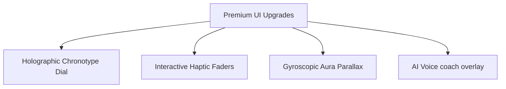

# UI/UX Audit & Layout Alignment Report
**Product:** VitaAI Wellbeing Companion (Android Client)  
**Date:** June 8, 2026  
**Auditor:** Antigravity (Senior UI/UX Specialist)

---

## Executive Summary
This audit reviews all Jetpack Compose screen layouts (`ui/screens`) and visual primitives (`ui/components`) in the VitaAI application. The objective is to identify layout alignment issues, sizing mismatches, container rendering inefficiencies, and visual clipping bugs. Additionally, we provide recommendations to elevate the visual polish to match a high-end, premium dashboard interface (specifically the "Shader Dash" light system: 78% white frosted-glass opacity, 7% black borders, glowing cyan accents) and propose futuristic Compose widgets for future implementation.

All analyzed issues have been mathematically or structurally verified against the Compose layout model.

---

## 1. Sizing Mismatches & Bento Grid Inconsistencies

### 1.1 ActivityScreen Bento Column Height Risk
* **File Reference:** `screens/ActivityScreen.kt`
* **Issue:** The main bento grid splits horizontal space between a left-side Steps Card (height `176.dp`) and a right-side column containing two cards (each `82.dp` height with `12.dp` spacing). While the math holds (`82 * 2 + 12 = 176`), the left card's internal content (a fixed `72.dp` `CircularProgressIndicator`, vertical labels, margins, and padding) is tightly constrained. If a user increases their system font size (accessibility scaling), the text inside the left Steps Card will overflow and clip vertically.
* **Impact:** Broken layouts on accessibility-configured devices.
* **Correction:** Introduce dynamic height wrapping using `Modifier.height(IntrinsicSize.Min)` or adjust the grid structure to allow the left card to scale its height alongside its right-hand siblings.

### 1.2 CircadianScreen Column Border Seam Misalignment
* **File Reference:** `screens/CircadianScreen.kt`
* **Issue:** The screen features a 2-column bento layout where the cards are staggered (Left column: `160.dp` & `180.dp`; Right column: `180.dp` & `160.dp`). Although the total height of both columns matches (`356.dp`), their middle horizontal borders are misaligned. While this is typical of staggered grids, the text and chart widgets inside are of fixed sizes, leading to potential layout overlaps or empty padding gaps when rendering metrics of variable lengths.
* **Impact:** Uneven text vertical distribution, breaking grid symmetry on smaller screens.
* **Correction:** Standardize card heights to `170.dp` to align center seams horizontally, or use a flexible flow layout that handles content wrapping dynamically.

### 1.3 SessionScreen HUDStatTile Internal Padding vs. Column Weight
* **File Reference:** `screens/SessionScreen.kt` (HUDStatTile)
* **Issue:** `HUDStatTile` wraps its layout with the standard `GlassCard`, which enforces a default `20.dp` internal padding. These tiles are placed side-by-side in a `Row` with `weight(1f)`. On a compact device (e.g., 360dp width), the horizontal padding consumes `40.dp` of each card's space, leaving less than `110.dp` for the actual icon, metric value, and unit.
* **Impact:** Values like `120 BPM` or `1,500 KCAL` are forced to wrap or overlap adjacent text elements, creating cramped HUD readouts.
* **Correction:** Add a parameter to `GlassCard` to override internal padding, allowing smaller grid cards to use a compact padding (e.g., `12.dp`).

---

## 2. UI Elements Bleeding, Overlapping & Clipping

### 2.1 CircadianClockDial Axis Labels Render Outside Canvas Bounds
* **File Reference:** `components/CircadianClockDial.kt`
* **Issue:** The circadian clock calculates its outer dial radius as `(size.minDimension / 2) * 0.85f`. This leaves only a `7.5%` margin on each side of the canvas. The labels ("12 AM", "12 PM", "6 AM", "6 PM") are drawn relative to this radius:
  * **Top ("12 AM"):** Baseline is `center.y - outerRadius - 8.dp`. With a canvas size of `200.dp` and outer radius of `85.dp`, this baseline is at `7.dp`. The text size is `12.sp` (approx `12.dp`), meaning the top portion of "12 AM" renders at `-5.dp` (outside the top boundary).
  * **Bottom ("12 PM"):** Baseline is `center.y + outerRadius + 20.dp`. This baseline calculates to `205.dp` (outside the `200.dp` canvas height boundary). The text is completely clipped and invisible.
  * **Left/Right ("6 PM"/"6 AM"):** Centered text elements are pushed within `7.dp` of the canvas side walls. The text widths exceed `14.dp`, causing them to bleed past the canvas boundaries.
* **Impact:** Clock labels are cut off or missing entirely, ruining the dial interface.
* **Correction:** Reduce the outer radius multiplier to `0.70f` or `0.72f` to allocate sufficient padding space within the Canvas for text rendering.

### 2.2 LuminousChart Edge Labels Bleeding
* **File Reference:** `components/LuminousChart.kt`
* **Issue:** The horizontal X-axis labels in `LuminousLineChart` and `LuminousBarChart` are drawn centered around their tick positions. The rightmost data point is drawn at `chartRight = width - rightPadding` where `rightPadding` is only `8.dp`. If the label is "Sun" or "Sat", the text will center at `width - 8.dp`, forcing half the label to render past the screen boundary.
* **Impact:** Clipped charts and text labels on the right edge of all line and bar charts.
* **Correction:** Increase `rightPadding` to at least `24.dp` or implement an edge-alignment check that aligns the last label to `Paint.Align.RIGHT` instead of `CENTER`.

### 2.3 Interactive Chart Tooltip Clipping on High Values
* **File Reference:** `components/LuminousChart.kt`
* **Issue:** Tooltip bounds checking only accounts for horizontal boundaries (`chartLeft` and `chartRight`). If a user drags to select a peak data point near the top of the chart, the tooltip baseline is calculated near the chart's top margin (`topPadding = 16.dp`). Drawing the tooltip background rect at this height places its top bounds outside the canvas, cutting it off.
* **Impact:** Peak chart values render incomplete or clipped tooltips.
* **Correction:** Include vertical boundary checks in the tooltip drawing logic: if `tooltipY - tooltipHeight < 0`, draw the tooltip *below* the active data point instead of *above* it.

### 2.4 ChatScreen Input Area Double Padding & TextField Bounds
* **File Reference:** `screens/ChatScreen.kt`
* **Issue:** The `ChatInput` row wraps a Material 3 `TextField`. The row defines height constraints and custom padding. However, `TextField` has its own built-in internal padding from the Material spec. This duplicate container padding causes the cursor, hint text, and user input to feel vertically cramped and misaligned within the glass border.
* **Impact:** Uneven vertical margins and clipped characters in the input field.
* **Correction:** Replace `TextField` with `BasicTextField` to remove Material's default container padding, allowing the outer glass `Row` to handle padding cleanly.

### 2.5 AnalyticsScreen RangeSelectorPill Modifier Ordering Bug
* **File Reference:** `screens/AnalyticsScreen.kt`
* **Issue:** Inside `RangeSelectorPill`, the active tab applies a shadow modifier *after* clipping and background modifiers:
  ```kotlin
  Modifier.clip(pillShape).background(bgColor).then(Modifier.shadow(...))
  ```
  In Jetpack Compose, the clip modifier limits the drawing bounds of the component. Applying `shadow` after `clip` means the shadow is rendered outside the clipped area, and since the view clips its drawing bounds, the shadow is completely cut off and invisible.
* **Impact:** Active tab indicators have no shadows, breaking the visual depth.
* **Correction:** Re-order the modifiers to place `.shadow(...)` before `.clip(pillShape)`.

---

## 3. Visual Polish & Style Guide Consistency

### 3.1 Redundant Double Shadow Drawing
* **File Reference:** `screens/DashboardScreen.kt` (`MetricCard`)
* **Issue:** The `MetricCard` modifier chain applies a custom shadow:
  ```kotlin
  GlassCard(modifier = modifier.shadow(...))
  ```
  However, `GlassCard` already applies its own shadow internally. Wrapping the card in an external shadow results in Compose drawing two shadows, which degrades UI rendering performance and causes muddy shadow layering artifacts.
* **Impact:** Render lag and inconsistent card outlines.
* **Correction:** Rely entirely on `GlassCard`'s internal shadow; remove the outer shadow modifier.

### 3.2 Basic Material Indicators vs. Premium Glow Components
* **File Reference:** `screens/ActivityScreen.kt`
* **Issue:** The steps tracker on the `ActivityScreen` uses a standard Material 3 `CircularProgressIndicator`. This contrasts with the custom glowing, animated, neon-accented `ProgressRing` used on the `SessionScreen`.
* **Impact:** Dilutes the premium, futuristic aesthetic.
* **Correction:** Replace the basic `CircularProgressIndicator` inside `ActivityScreen`'s Steps Card with the custom `ProgressRing`.

### 3.3 PageHeader Title Text Push Bug
* **File Reference:** `components/PageHeader.kt` (and `DashboardHeader`)
* **Issue:** The header uses a `Row` containing a `Column` (Kicker & Title) on the left and an "AI Sync" active ping badge on the right. Because there are no width constraint weights on the Title column, a long title like "CIRCADIAN SYNC" will expand and push the "AI Sync" badge off the right edge of the screen.
* **Impact:** UI elements pushed off-screen on narrow layouts.
* **Correction:** Apply `Modifier.weight(1f)` to the Title `Column` to allow it to wrap titles gracefully while maintaining the badge's position.

---

## 4. Modern & Futuristic UI/UX Proposals

To elevate the application's premium feeling and deliver a visual design similar to modern holographic/cyberpunk biosensors:



### 4.1 Holographic Sleep Cycle Chronotype Widget
* **Concept:** Expand the `CircadianClockDial` into an interactive, multi-layered orbital ring. Different biological phases (melatonin production, deep sleep, cortisol release, and wind-down windows) are drawn as colored glowing arc segments. When clicked, the orbit rotates with inertial friction animations to detail the chosen circadian phase.
* **Implementation:** Custom `Canvas` using sweep gradients and math calculations driven by touch gesture tracking in a `pointerInput` block.

### 4.2 Gyroscopic Parallax Aura Card
* **Concept:** Make the dashboard cards feel alive. Using the device's physical gyroscope sensor, the neon aura glow behind the cards (`GlassCardGlow`) shifts dynamically in 3D space as the user tilts their phone.
* **Implementation:** Subscribe to the Android `Sensor.TYPE_ROTATION_VECTOR` in a `LaunchedEffect`, converting yaw and pitch angles to offset values in the card's `graphicsLayer` modifier.

### 4.3 Interactive Haptic Macro Faders
* **Concept:** Replace standard text inputs for quick-adding carbs, fat, and protein on the `NutritionScreen` with sleek, horizontal glass faders. Sliding the faders increments values with subtle haptic vibrations (clicks) at every 5g or 10g interval.
* **Implementation:** Custom slider design utilizing Compose `pointerInput` horizontal drag gestures, linked to `LocalView.current.performHapticFeedback()`.

### 4.4 Voice-to-Protocol AI Coach Overlay
* **Concept:** Add a voice-activation shortcut in the `ChatScreen` or `DashboardScreen`. Long-pressing the microphone button displays a full-screen blurred backdrop with a glowing, sound-wave-reactive circular aura. This visualizer morphs in size based on voice decibels while the user verbally logs meals or queries their health snapshot.
* **Implementation:** Draw a reactive path on a `Canvas` with Bezier curves modulated by mic input amplitude, overlaying the active screen using standard Compose animated visibility transitions.
