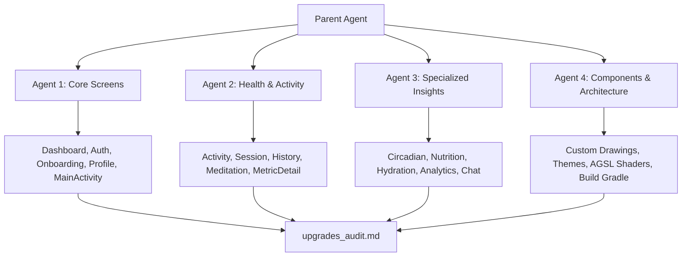

# Master UI/UX, Accessibility, and Code Architecture Upgrades Report

**Date:** June 8, 2026  
**Project:** VitaAI Android App (`c:\Users\rk107\wellbeing_firebase`)  
**Scope:** MainActivity, Dashboard, Auth, Onboarding, Profile, Activity, Workout Session, History, Meditation, Metric Detail, Circadian, Nutrition, Hydration, Analytics, Chat screens, custom drawing components, and build configurations.

---

## Executive Summary & Agent Division of Labor

To conduct this audit, four specialized subagents were deployed concurrently to perform a deep-dive analysis of the codebase, dividing the work to uncover visual inconsistencies, user experience gaps, accessibility shortcomings, performance bottlenecks, and architectural issues.



### Key Metrics Identified
* **Performance Bottlenecks:** Object allocations (`Paint`, `Path`, `Brush`) in drawing loops across **15 custom canvas components** (causes GC thrashing, battery drain, UI stutter).
* **Hardcoded Colors:** Over **350+ hex color instances** (e.g. `Color(0xFF0F172A)`) that break dark theme support.
* **Accessibility Gaps:** **29+ missing contentDescriptions** on key icons and **touch targets below 48dp** on filters, chips, and buttons.
* **Critical Code Defects:** A frozen AGSL animated shader, a database read loop inside a scrollable LazyColumn, a location/GPS tracker leak when paused, and a dummy chatbot that ignores user text inputs.

---

## 1. Core Screens & Navigation Audit (Agent 1)
*Focus: [MainActivity](file:///c:/Users/rk107/wellbeing_firebase/app/src/main/java/com/example/vitaai/ui/MainActivity.kt), [DashboardScreen](file:///c:/Users/rk107/wellbeing_firebase/app/src/main/java/com/example/vitaai/ui/screens/DashboardScreen.kt), [AuthScreen](file:///c:/Users/rk107/wellbeing_firebase/app/src/main/java/com/example/vitaai/ui/screens/AuthScreen.kt), [OnboardingNameScreen](file:///c:/Users/rk107/wellbeing_firebase/app/src/main/java/com/example/vitaai/ui/screens/OnboardingNameScreen.kt), [ProfileScreen](file:///c:/Users/rk107/wellbeing_firebase/app/src/main/java/com/example/vitaai/ui/screens/ProfileScreen.kt)*

### **UI & Visual Design Inconsistencies**
* **Inconsistent Color References:** Slate-900 (`Color(0xFF0F172A)`) is hardcoded on line 99, 123, 304, 306, 335, 337, and 499 of `ProfileScreen.kt`, and line 849 of `DashboardScreen.kt`. This completely overrides dark theme styles.
* **AlertDialog Theme Violations:** Calibration and link-account popups in `ProfileScreen.kt` use hardcoded styling. They override container colors to solid white, producing blinding glare in dark theme.
* **Hardcoded Layout Constants:** Bottom navigation elements in `MainActivity.kt` use hardcoded color values, and their active text style uses hardcoded font sizes.

### **UX Flow Improvements**
* **GlobalScope Leak in Navigation:** In `MainActivity.kt:L77`, a data synchronization request is initiated using `GlobalScope.launch(Dispatchers.IO) { coordinator.fullSync() }`. This escapes lifecycle constraints, risking memory leaks when the Activity is recreated.
* **Calibration Chip Touch Ranges:** In `ProfileScreen.kt:L329-L347`, activity factor selection chips use a vertical padding of `10.dp` and a font size of `9.sp`. This results in clickable touch areas of ~28dp, which are hard to tap.
* **Error Lockout in Seeding:** In `DashboardViewModel.kt`, any database seeding failure during initialization sets the entire dashboard screen state to `DashboardUiState.Error`, locking the user out of all cached dashboard data.

### **Accessibility Gaps**
* **Missing contentDescriptions:** The `Favorite` icon (`DashboardScreen.kt:L140`), `AutoAwesome` icon (`DashboardScreen.kt:L807`), and `Person` avatar icon (`ProfileScreen.kt:L104`) lack descriptions, reading as "unlabelled button" to screen readers.
* **Tappable Hero Header Semantics:** The entire Profile Hero card is clickable to rename the user, but the click behavior and text description are not grouped or announced properly.

---

## 2. Health Tracking, Workouts, & Meditation Audit (Agent 2)
*Focus: [ActivityScreen](file:///c:/Users/rk107/wellbeing_firebase/app/src/main/java/com/example/vitaai/ui/screens/ActivityScreen.kt), [SessionScreen](file:///c:/Users/rk107/wellbeing_firebase/app/src/main/java/com/example/vitaai/ui/screens/SessionScreen.kt), [HistoryScreen](file:///c:/Users/rk107/wellbeing_firebase/app/src/main/java/com/example/vitaai/ui/screens/HistoryScreen.kt), [MeditationScreen](file:///c:/Users/rk107/wellbeing_firebase/app/src/main/java/com/example/vitaai/ui/screens/MeditationScreen.kt), [MetricDetailScreen](file:///c:/Users/rk107/wellbeing_firebase/app/src/main/java/com/example/vitaai/ui/screens/MetricDetailScreen.kt)*

### **UI & Visual Design Inconsistencies**
* **Hardcoded Palette Values:** Hex colors are hardcoded inline (e.g. `Color(0xFFEAB308)` for yellow/gold at lines 509 and 518 of `ActivityScreen.kt`) rather than resolving from `LocalVitaColors.current` tokens.
* **Card Title & Text Strings:** Labels such as `"REST REMAINING"`, `"ELAPSED TRAINING TIME"`, and `"ABANDON PROTOCOL?"` are hardcoded strings, hindering future localization.
* **Pace Unit Hardcoding:** The pace calculation in `WorkoutSessionViewModel.kt:L201` is hardcoded to `"/KM"`. Toggling the app to imperial mode displays incorrect calculations.

### **UX Flow Improvements**
* **Custom Protocol GPS Bug:** In `ActivityScreen.kt:L1091`, selecting a "Cardio" category activates `gpsEnabled = true`. Switching the category back to "Strength" (where the GPS switch is hidden) leaves `gpsEnabled` set to `true`. This causes Strength templates to be saved with GPS enabled.
* **Vibrations in UI Thread:** Workout session haptic ticks are handled inside the composable UI rendering layer via `LaunchedEffect` and `VIBRATOR_SERVICE` (`SessionScreen.kt:L134-152`). This logic belongs in the ViewModel.
* **GPS & Battery Leak during Pause:** Pausing a workout session does not cancel the GPS tracking routine (`locationJob` in `WorkoutSessionViewModel.kt:L232-253`). It continues to poll locations in the background, draining the battery.
* **Active Timer Busy Loop:** The workout timer job runs a continuous `while (true)` loop with a delay when paused, consuming unnecessary CPU cycles.

### **Performance & Architecture Violations**
* **Critical Database Read Loop in Scroll List:** In `HistoryScreen.kt:L128`, the LazyColumn item renderer `WorkoutHistoryCard` executes `viewModel.getExerciseSets(session.id)` inside the list row drawing logic. This triggers a database query flow for *every single item scrolled into view*, causing severe scroll stutter.

### **Accessibility Gaps**
* **No Label on Adjusters:** The weight/reps modifier buttons (`+2.5`, `-2.5`, etc.) in `SessionScreen.kt:L284-338` lack content descriptions.
* **Streak Indicator Accessibility:** Streak tracker items in `HistoryScreen.kt:L245-259` only announce the letters "M, T, W..." to TalkBack, hiding whether the day's goal was completed or missed.

---

## 3. Specialized Insights, Nutrition, & AI Chat Audit (Agent 3)
*Focus: [CircadianScreen](file:///c:/Users/rk107/wellbeing_firebase/app/src/main/java/com/example/vitaai/ui/screens/CircadianScreen.kt), [NutritionScreen](file:///c:/Users/rk107/wellbeing_firebase/app/src/main/java/com/example/vitaai/ui/screens/NutritionScreen.kt), [HydrationDetailScreen](file:///c:/Users/rk107/wellbeing_firebase/app/src/main/java/com/example/vitaai/ui/screens/HydrationDetailScreen.kt), [AnalyticsScreen](file:///c:/Users/rk107/wellbeing_firebase/app/src/main/java/com/example/vitaai/ui/screens/AnalyticsScreen.kt), [ChatScreen](file:///c:/Users/rk107/wellbeing_firebase/app/src/main/java/com/example/vitaai/ui/screens/ChatScreen.kt)*

### **UI & Visual Design Inconsistencies**
* **Clock Labels Contrast Bug:** In `CircadianClockDial.kt:L245`, hour labels are hardcoded to dark slate: `color = Color(0xFF0F172A).toArgb()`. In dark theme, these labels blend into the dark screen background, rendering the biological phase clock dial unreadable.
* **Static Category Matches:** Food category filtering is hardcoded to a static list of exact name matches (`NutritionScreen.kt:L58-L60`). Custom user-added foods (e.g. "Scrambled Eggs") are excluded from categories.

### **UX Flow Improvements**
* **Hydration Progress Calculation Bug:** The Hydration Progress Ring displays consumed volume by back-calculating from the progress percentage against a hardcoded goal of `2500 ml` (`HydrationDetailScreen.kt:L285-L294`). If the user changes their water goal, the displayed volume becomes incorrect.
* **Interactive Tooltip Instability:** Chart tooltips in `LuminousChart.kt` disappear the instant the user lifts their finger (`tryAwaitRelease()`). This makes reading data points frustrating.
* **Dummy AI Chatbot:** The AI Chatbot ignores the user's message input entirely (`ChatViewModel.kt:L35-L41`). It calls a static method `getAiInsight(snapshot)` to fetch a pre-generated daily health summary instead of processing the user's prompt.
* **Single-Line Chat Input:** The message field in `ChatScreen.kt:L459` is set to `singleLine = true`, forcing long messages to scroll horizontally.

### **Performance & Safety Violations**
* **Divide by Zero Risk in Weekly Charts:** If the hydration goal is parsed as 0 and weekly history is empty, the weekly bar calculator (`HydrationDetailScreen.kt:L327`) divides by zero, rendering `NaN` or `Infinity` coordinates on the Canvas.
* **Lazy List Animation Churn:** In `ChatScreen.kt:L95-101`, `AnimatedVisibility(visible = true)` is used around every chat item. This triggers the entry animation every time a list item is recycled and scrolled back into view.

---

## 4. Reusable Components & Custom Shaders Audit (Agent 4)
*Focus: [ui/components/](file:///c:/Users/rk107/wellbeing_firebase/app/src/main/java/com/example/vitaai/ui/components/) (e.g. LuminousChart, SloshingWaterCapsule, AuraBackground, SkeletonLoaders, ShaderBackground, ModifierExtensions)*

### **A. Paint, Path, and Brush Object Allocations in Drawing Loops**
Allocating drawing tools (`Paint`, `Path`, `Brush`) inside the draw phase of custom Canvas elements causes frequent Garbage Collection (GC) pauses, resulting in visible UI stutters.

| Composable File | Line Numbers | Allocated Objects | Occurrence |
| :--- | :--- | :--- | :--- |
| [ModifierExtensions.kt](file:///c:/Users/rk107/wellbeing_firebase/app/src/main/java/com/example/vitaai/ui/components/ModifierExtensions.kt) | L32, L50 | `outerPath`, `highlightPath` | **Every frame** on containers using `.glassmorphicBorder()` |
| [SkeletonLoaders.kt](file:///c:/Users/rk107/wellbeing_firebase/app/src/main/java/com/example/vitaai/ui/components/SkeletonLoaders.kt) | L102 | `Brush.linearGradient` | **Every frame** of shimmer loading loop |
| [SloshingWaterCapsule.kt](file:///c:/Users/rk107/wellbeing_firebase/app/src/main/java/com/example/vitaai/ui/components/SloshingWaterCapsule.kt) | L40, L59 | `path`, `waterPath` | **Every frame** of wave animation |
| [FluidSloshingProgressBar.kt](file:///c:/Users/rk107/wellbeing_firebase/app/src/main/java/com/example/vitaai/ui/components/FluidSloshingProgressBar.kt) | L67, L78 | `path`, `wavePath` | **Every frame** of progress animation |
| [ProgressRing.kt](file:///c:/Users/rk107/wellbeing_firebase/app/src/main/java/com/example/vitaai/ui/components/ProgressRing.kt) | L99 | `Brush.sweepGradient` | **Every frame** of pulsing animations |
| [CircadianClockDial.kt](file:///c:/Users/rk107/wellbeing_firebase/app/src/main/java/com/example/vitaai/ui/components/CircadianClockDial.kt) | L204, L229, L243, L292 | `Paint`, Sweep Gradient, label & glow Paint | **Every frame** of circadian dial animation |
| [CircadianEnergyCurve.kt](file:///c:/Users/rk107/wellbeing_firebase/app/src/main/java/com/example/vitaai/ui/components/CircadianEnergyCurve.kt) | L151-152, L177, L207 | `energyPath`, `pressurePath`, `fillPath`, text Paint | **Every frame** during drag scrubbing |
| [LuminousChart.kt](file:///c:/Users/rk107/wellbeing_firebase/app/src/main/java/com/example/vitaai/ui/components/LuminousChart.kt) | Various | Multiple tooltip/axis label Paint objects | **Every frame** during chart scrubbing |
| [LuminousLuxTimeline.kt](file:///c:/Users/rk107/wellbeing_firebase/app/src/main/java/com/example/vitaai/ui/components/LuminousLuxTimeline.kt) | L143, L153, L167, L189, L216 | Paint, glow Paint, timeline path, fill path | **Every frame** of timeline loading |
| [ShaderBackground.kt](file:///c:/Users/rk107/wellbeing_firebase/app/src/main/java/com/example/vitaai/ui/components/ShaderBackground.kt) | L155, L167, L179, L193 | 3x Radial Gradients, 1x Vertical Gradient | **Every frame** of canvas-based shader fallback |

* **Recommended Solution:** Replace `drawBehind` with `drawWithCache` or `remember` to reuse path and paint instances across frame updates.

### **B. AGSL Shader Animation Freeze**
In `ShaderBackground.kt:L68-L116`, the `time` state is updated every frame inside a `withFrameNanos` loop. However, since `time` is never read in the `Canvas` draw block, Compose does not invalidate the canvas, leaving the background **frozen** on API 33+ devices.
* **Recommended Solution:** Read the `time` variable inside the `Canvas` drawing block to register a state read:
  ```kotlin
  Canvas(modifier = Modifier.fillMaxSize()) {
      val t = time // Registers state read to trigger invalidation on frame ticks
      drawRect(brush = brush, size = size)
  }
  ```

### **C. Redundant Shadows on Glass Cards**
`GlassCard` and its variants draw custom paint shadows (`setShadowLayer`) inside `drawBehind` while simultaneously applying a layout shadow via `.graphicsLayer(shadowElevation)`. This creates duplicate shadow rendering overhead.

### **D. StatChip Text Contrast Bug**
In `StatChip.kt:L19-L39`, `textColor` defaults to `PrimaryContainer`, which has an opacity of 10% (`0xFF06B6D4` with alpha = 0.1f). This makes the text virtually invisible.
* **Recommended Solution:** Change the default text color to `Primary` or full opacity.

### **E. Code Duplication & Component Drift**
* **Buttons:** `GlowPrimaryButton`, `GlowButtonPrimary`, and `GlowButton` duplicate button styles, shadows, and animations.
* **Progress Bars:** `SloshingWaterCapsule` and `FluidSloshingProgressBar` duplicate wave math and drawings.
* **Shimmers:** `LoadingShimmer` and `shimmerOverlay` duplicate linear gradient shimmer animations.

---

## 5. Gradle Dependencies & Build Auditor Upgrades
*Focus: [build.gradle.kts](file:///c:/Users/rk107/wellbeing_firebase/build.gradle.kts), [app/build.gradle.kts](file:///c:/Users/rk107/wellbeing_firebase/app/build.gradle.kts), [settings.gradle.kts](file:///c:/Users/rk107/wellbeing_firebase/settings.gradle.kts)*

1. **Compose BOM Upgrade:** Upgrade the old Compose BOM version (`2024.02.00`) to `2024.12.01` or `2025.02.00` to leverage compiler optimizations.
2. **KAPT to KSP Migration:** Migrating from `kotlin-kapt` to `com.google.devtools.ksp` for Hilt and Room compilation will speed up build times.
3. **Core Dependency Upgrades:**
   * `androidx.core:core-ktx` to `1.15.0`
   * `androidx.lifecycle:lifecycle-runtime-ktx` to `2.8.7`
   * `androidx.activity:activity-compose` to `1.10.0`
   * `com.squareup.retrofit2:retrofit` to `2.11.0`

---

## 6. Action Plan & Priority Matrix

| Severity | Category | Target Component / File | Issue Description | Suggested Fix |
| :--- | :--- | :--- | :--- | :--- |
| 🔴 **Critical** | **Performance** | [modifier/draw loops](file:///c:/Users/rk107/wellbeing_firebase/app/src/main/java/com/example/vitaai/ui/components/) | `Paint`/`Path` allocations inside drawing cycles | Refactor drawing components using `drawWithCache`. |
| 🔴 **Critical** | **UX Bug** | [HydrationDetailScreen.kt](file:///c:/Users/rk107/wellbeing_firebase/app/src/main/java/com/example/vitaai/ui/screens/HydrationDetailScreen.kt) | Volume calculations based on hardcoded `2500ml` goal | Calculate volume using the goal from the StateFlow. |
| 🔴 **Critical** | **Logic Defect** | [ChatViewModel.kt](file:///c:/Users/rk107/wellbeing_firebase/app/src/main/java/com/example/vitaai/ui/screens/ChatViewModel.kt) | Chatbot ignores user message input | Pass the user message prompt to the AI service. |
| 🟠 **High** | **Visual / UX** | [ShaderBackground.kt](file:///c:/Users/rk107/wellbeing_firebase/app/src/main/java/com/example/vitaai/ui/components/ShaderBackground.kt) | AGSL Shader is frozen/static on API 33+ | Read `time` inside the Canvas block to force invalidation. |
| 🟠 **High** | **Accessibility** | [StatChip.kt](file:///c:/Users/rk107/wellbeing_firebase/app/src/main/java/com/example/vitaai/ui/components/StatChip.kt) | StatChip text color has 10% opacity (invisible) | Default `textColor` to full-opacity `Primary`. |
| 🟠 **High** | **Visual / Dark** | [CircadianClockDial.kt](file:///c:/Users/rk107/wellbeing_firebase/app/src/main/java/com/example/vitaai/ui/components/CircadianClockDial.kt) | Clock labels are invisible in Dark Mode | Use `MaterialTheme.colorScheme.onSurface`. |
| 🟠 **High** | **Performance** | [HistoryScreen.kt](file:///c:/Users/rk107/wellbeing_firebase/app/src/main/java/com/example/vitaai/ui/screens/HistoryScreen.kt) | Database reads inside list scroll renderer | Fetch session sets in a single query (e.g. SessionWithSets). |
| 🟠 **High** | **Leak Risk** | [WorkoutSessionViewModel.kt](file:///c:/Users/rk107/wellbeing_firebase/app/src/main/java/com/example/vitaai/ui/screens/WorkoutSessionViewModel.kt) | GPS location updates leak when paused | Cancel GPS flow when paused, resume when active. |
| 🟡 **Medium** | **UX Flow** | [ActivityScreen.kt](file:///c:/Users/rk107/wellbeing_firebase/app/src/main/java/com/example/vitaai/ui/screens/ActivityScreen.kt) | GPS flag persists when switching categories | Reset `gpsEnabled = false` for non-cardio templates. |
| 🟡 **Medium** | **Theme / Color** | All Screens | 350+ hardcoded hex colors override dark theme | Map hex colors to `LocalVitaColors` or Material theme. |
| 🟡 **Medium** | **Accessibility** | All Screens | 29 missing contentDescriptions / small touch targets | Add missing descriptions and expand targets to >=48dp. |
| 🟢 **Low** | **Redundancy** | All Components | Duplicate button, progress bar, and shimmer components | Consolidate duplicate UI components. |
